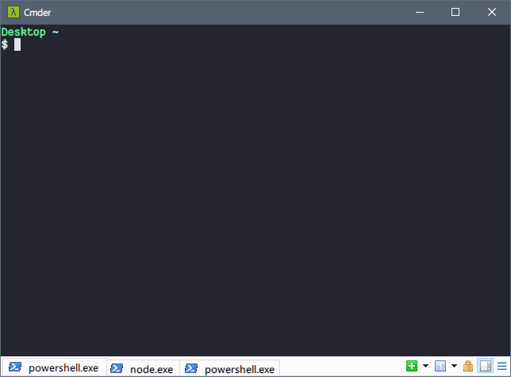

<div align="center">
    <h1 align="center">🐟 dorado</h1>
    <p align="center">
        <a href="https://ci.appveyor.com/project/h404bi/dorado/branch/master"></a>
        <a href="https://github.com/h404bi/dorado/blob/master/LICENSE"></a>
        <a href="https://www.microsoft.com/en-us/windows"></a>
        <a href="https://github.com/h404bi/dorado"></a>
        <a href="https://github.com/h404bi/awesome-scoop/blob/master/README.md" title="Awesome Scoop"></a>
    </p>
    <p align="center">
        <a href="README.md">English</a>|<a href="README_CN.md">简体中文</a>
    </p>
    <p align="center"></p>
    <p align="center">
        又一个 <a href="https://github.com/lukesampson/scoop">Scoop</a> 的软件仓库（<a href="https://github.com/lukesampson/scoop/wiki/Buckets">bucket</a>）
    </p>
    <p align="center">
        宗旨：本仓库内的所有软件在安装时都<strong>无需</strong>管理员权限，同时<strong>尽可能地</strong>保持软件原始配置（即无主观安装设置）
    </p>
</div>

特色软件
------------

| 软件 | 简介 |
|----------|-------------|
| multimc | 大概是，全世界最好用的正版 Minecraft 启动器 |
| hmcl | 极受欢迎的国产 Minecraft 启动器 |
| itch | itch.io 客户端，发现更多独立游戏/软件 |
| liko-12 | 没有 PICO-8？可以试试 LIKO-12，也是很好玩的 |
| neteasemusic | 网易云音乐 —— 发现、分享 |
| nuwen-mingw-gcc | 来自微软职工 nuwen 的最小 GCC 工具包，源自 [MinGW Distro](https://nuwen.net/mingw.html) |
| nvm-windows | 颇受欢迎的 [nvm-windows](https://github.com/coreybutler/nvm-windows) 的修改版，移除了管理员提权要求，使得低权限的普通用户亦可无障碍使用 |
| tcping | 通过 TCP 进行 ping 操作 |
| translucenttb | 你可能需要的 Windows 10 任务栏透明化小工具 |
| trash | 将待删除文件移至回收站，而不是直接 `rm-rf`，类似于 macOS 的 trash |
| yarn | 非便携版的 Yarn，全局安装的 `node_modules` 仍然保持在原有的 `$env:LOCALAPPDATA\\Yarn\\bin` 路径下 |
| wechat | 你可能需要的微信 PC 客户端 |

更多待你发现~

疑问
--------

**1. 如何安装该软件仓库中的软件？**

确保你已经有 Scoop 环境，执行以下命令订阅本软件仓库：

``` powershell
scoop bucket add dorado https://github.com/h404bi/dorado
```

执行以下命令安装本仓库中的软件：

``` powershell
scoop install dorado/<软件名>
```

**2. 我想要某个软件，这个仓库里没有！**

开 [issue](https://github.com/h404bi/dorado/issues)，描述你的需求。:)

**3. 仓库中的某个软件版本落后了，求更新！**

欢迎 Fork 本仓库，修改落后的软件清单，并提交你的拉取请求。:D
